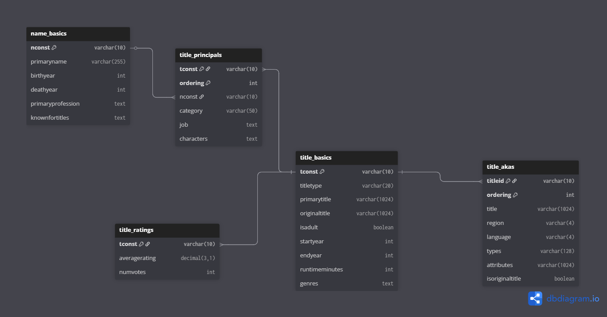

# IMDb Data Analytics with PostgreSQL

This project explores the **IMDb dataset** using advanced SQL analytics.  
The goal is twofold:  
1. Extract meaningful insights about movies, directors, genres, and actors. 
2. Showcase SQL skills with CTEs, self-joins, cross join lateral, Bayesian weighting, ordered-set aggregates, and co-occurrence analysis.

---

## 🎯 Why this project?
I wanted to combine my background in data and business analysis with hands-on SQL practice.  
By focusing on IMDb, a widely recognized dataset, the project highlights how **complex queries** can reveal hidden patterns in the movie industry while also serving as a **portfolio showcase**.

---

## 📂 Dataset & Schema
The data comes from the IMDb dataset available on [Kaggle](https://www.kaggle.com/datasets/ashirwadsangwan/imdb-dataset).
Main tables used:
- `title_akas` → alternate titles (used to build *US display title* reference).
- `title_basics` → movie metadata (year, runtime, genres).
- `title_ratings` → IMDb ratings and number of votes.
- `title_principals` → people (directors, actors, actresses) associated with titles.
- `name_basics` → personal information about movie participants.

I created a base **view `us_display_title`** to consistently select one canonical title per movie (region `US`, type `imdbDisplay`).

### Database Schema
The following database diagram summarizes the core tables and their relationships:

  

---

## ⚙️ How to run
1. Run the Jupyter notebook [`imdb_data_loader.ipynb`](imdb_data_loader.ipynb) to create the PostgreSQL tables and load the IMDb TSV data into the database.  
2. Execute the queries in [`imdb_data_analytics.sql`](imdb_data_analytics.sql) to reproduce the analysis and insights.  

---

## 🛠️ Environment
- Python 3.13.5
- PostgreSQL 17 (tested)
- Required Python packages: see [requirements.txt](requirements.txt)

---

## 🔎 Queries & Insights

### 1) **Top Movies — Bayesian Ranking**
Ranks movies using a Bayesian formula that balances high ratings with the number of votes (avoids bias from obscure films with few ratings).

### 2) **Movies per Decade & Genre**
Counts films produced by decade and genre, showing industry trends (e.g., Westerns in the 60s vs. Sci-Fi in the 2000s).

### 3) **Movie Length Trends**
Analyzes average runtime and standard deviation per year (only years with >500 movies for robustness).

### 4) **Genre Affinity**
Finds genre pairs that frequently co-occur (e.g., “Action–Adventure”), useful to study hybrid genres.

### 5) **Director Consistency**
Calculates directors’ average movie ratings weighted by log(votes), to highlight consistent quality over career.

### 6) **Actor–Actor Pairs**
Detects recurring actor duos (≥3 movies together). Example: frequent collaborations like De Niro–Pacino. 

---

## 📊 Outputs
For reproducibility, each query stores a **CSV snapshot with the first 50 rows** in the [`/outputs`](outputs) folder.  
This keeps the repository lightweight in terms of performance and storage.  
To regenerate full results, run the SQL in [`imdb_data_analytics.sql`](imdb_data_analytics.sql).

